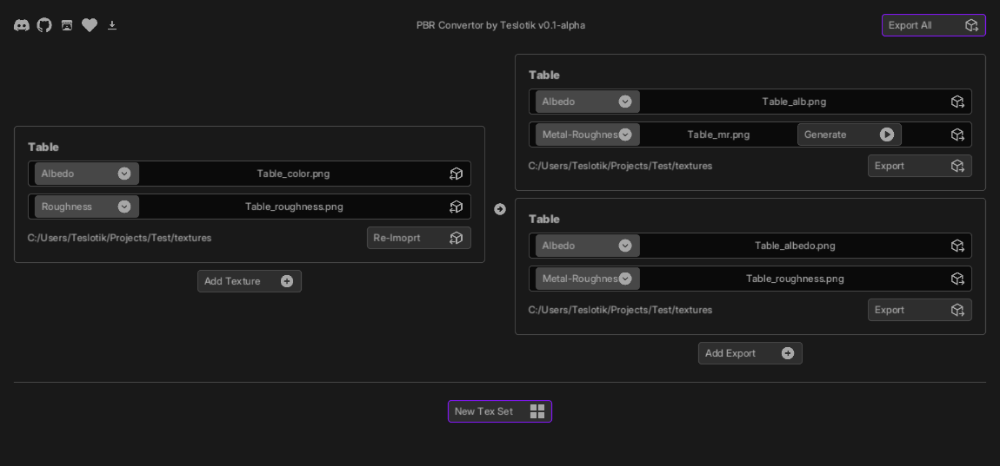
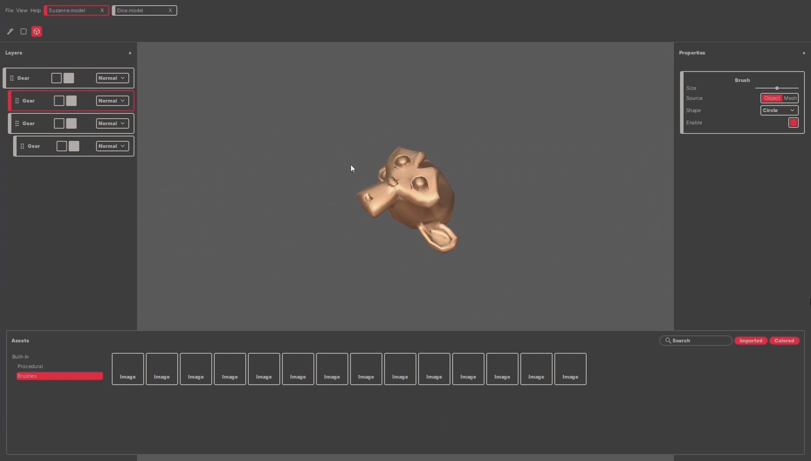
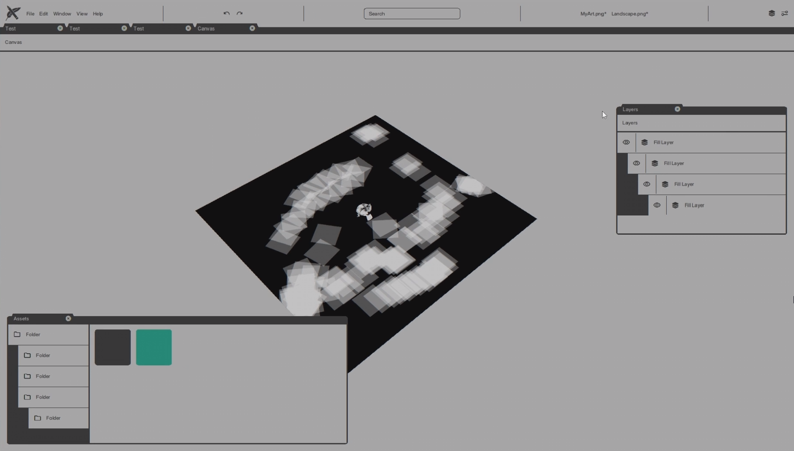

# Juil - Just UI Layouts

The layout engine targeting to be rich, simple to use, lightweight and framework agnostic.

Build you own GUI for game/applications using powerful solver!

_Rendering backend is not supplied and not planned._

**You can find examples for HaxeFlixel and Kha in the examples folder**

## Features

1. Just two major classes - a Widget to store values and a Form to solve layout.

2. You can think it as a Figma Auto Layout + constraints.

3. Rich properties.

- `size` and `position` info

- four anchors for each side (`Fixed`, `Scale`, `Center`)

- layout direction (`Row`, `Column`, `Stack`)

- stretch policy (`Fixed`, `Fill`, `Hug`)

- vertical and horizontal `gap` with `Even` and `Fixed` policy

- content `wrap`

- `enable` flag

- `pivot`

- `margins` and `paddings`

- `min`/`max` sizes

- size `aspect`

- `justify` and `align`

4. No `Dynamic`/`Any` or reflection

## How to use

1. Create widgets directly using `Widget` structure or throught the factory using `Form.CreateWidget()`.

```haxe
var widget = Form.CreateWidget(widget -> {
    widget.x = 10;
    widget.y = 10;
    widget.horizontal = Fixed(100);
    widget.vertical = Fixed(100);
});
```

2. Create a `Form` and pass the root widget.

```haxe
var form = new Form(widget);
```

3. Add to the form widgets and create hierarchy using `Form.addWidget()`. Pass the widget you want to add as a first parmameter and parent widget as a second.

```haxe
form.addWidget(widget);
form.addWidget(widget2, widget);
form.addWidget(widget3, widget);
form.addWidget(widget4, widget);
form.addWidget(widget5, widget);
```

4. Call the `Form.update()` function inside game loop.

For HaxeFlixel:

```haxe
override public function update(elapsed:Float) {
    super.update(elapsed);
    
    // Update the form
    form.update();
}
```

## Screenshots





